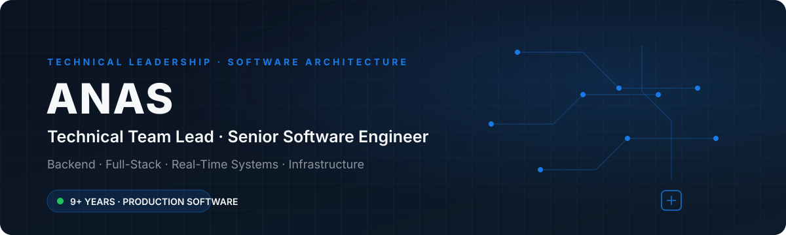
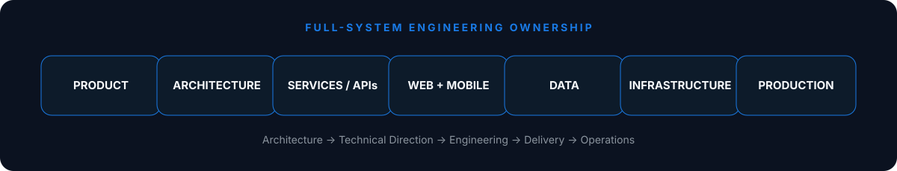

 

## Profile

Technical Team Lead and Senior Software Engineer with **9+ years building and leading production software** across enterprise, logistics, SaaS, fintech, event technology, and mobile products. I work from system architecture and backend services through product delivery, infrastructure, and production operations.

`ARCHITECTURE` → `BACKEND` → `FRONTEND` → `MOBILE` → `INFRASTRUCTURE` → `PRODUCTION`

## What I Build

<table>
<tr>
<td width="33%"><strong>▰ Enterprise Platforms</strong> Complex business systems, permissions and operational workflows.</td>
<td width="33%"><strong>▰ Logistics Technology</strong> Shipment, carrier, tracking, mapping and transportation platforms.</td>
<td width="33%"><strong>⚡ Real-Time Systems</strong> WebSockets, live state, tracking and event-driven workflows.</td>
</tr>
<tr>
<td><strong>⌁ API Ecosystems</strong> Secure APIs, integrations and asynchronous services.</td>
<td><strong>◇ Web & Mobile</strong> Production web platforms and cross-platform applications.</td>
<td><strong>☁ Cloud & Infrastructure</strong> Containers, Linux, deployment, monitoring and operations.</td>
</tr>
</table>

## Technology Stack

&nbsp;&nbsp;
&nbsp;&nbsp;
&nbsp;&nbsp;
&nbsp;&nbsp;
&nbsp;&nbsp;
&nbsp;&nbsp;
&nbsp;&nbsp;

  

&nbsp;&nbsp;
&nbsp;&nbsp;
&nbsp;&nbsp;
&nbsp;&nbsp;
&nbsp;&nbsp;
&nbsp;&nbsp;
&nbsp;&nbsp;
&nbsp;&nbsp;

  

PHP · Symfony · Node.js &nbsp; | &nbsp; TypeScript · React · Next.js · Tailwind · React Native &nbsp; | &nbsp; PostgreSQL · MySQL · MongoDB &nbsp; | &nbsp; Docker · Linux · Git

## Engineering Ownership

## Engineering Specialties

<table>
<tr>
<td width="50%"><strong>🏗 Software Architecture</strong> Modular systems, domain boundaries and architecture designed for change.</td>
<td width="50%"><strong>⚙ Backend Systems</strong> APIs, authentication, integrations, business services and asynchronous processing.</td>
</tr>
<tr>
<td><strong>⚡ Real-Time Architecture</strong> Events, WebSockets, live tracking, notifications and synchronized state.</td>
<td><strong>🌐 Full-Stack Platforms</strong> Backend, web, mobile and data working as one production product.</td>
</tr>
<tr>
<td><strong>☁ Infrastructure</strong> Containerization, Linux, deployment, observability and production operations.</td>
<td><strong>🧭 Technical Leadership</strong> Architecture decisions, technical direction, delivery strategy and engineering quality.</td>
</tr>
</table>

## Systems I've Built

<table>
<tr><td><strong>LOGISTICS PLATFORMS</strong></td><td>Shipment workflows · bidding · tracking · carrier operations · maps · notifications</td></tr>
<tr><td><strong>ENTERPRISE SYSTEMS</strong></td><td>Authorization · workflows · integrations · operational tooling</td></tr>
<tr><td><strong>REAL-TIME PRODUCTS</strong></td><td>WebSockets · location tracking · events · state synchronization</td></tr>
<tr><td><strong>API PLATFORMS</strong></td><td>Authentication · integrations · async processing · service architecture</td></tr>
<tr><td><strong>MOBILE PRODUCTS</strong></td><td>Cross-platform applications · backend integration · real-time workflows</td></tr>
<tr><td><strong>PRODUCTION INFRASTRUCTURE</strong></td><td>Docker · Linux · deployment · monitoring · performance</td></tr>
</table>

### Current Focus

### Engineering Principles

`Architecture before complexity` &nbsp; · &nbsp; `Reliability over cleverness` &nbsp; · &nbsp; `Automate repetitive work` &nbsp; · &nbsp; `Design for change`

> ### 🔒 Private Production Work
> Most production systems I've worked on are maintained in private repositories due to enterprise and client confidentiality. Public GitHub activity represents only a portion of my engineering work.

---

### Let's build something that has to work in production.

**Software Architecture · Technical Leadership · Enterprise Platforms · Product Engineering**

  

**ANAS**  
Technical Team Lead · Senior Software Engineer

